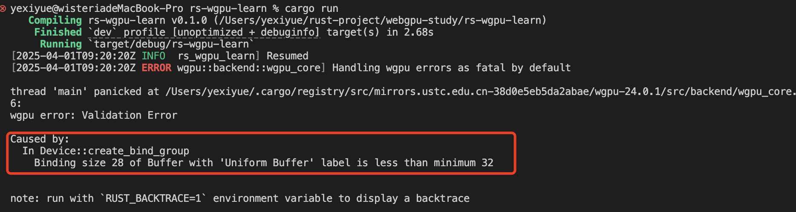
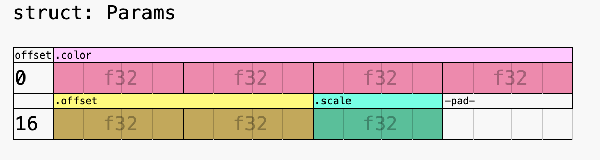
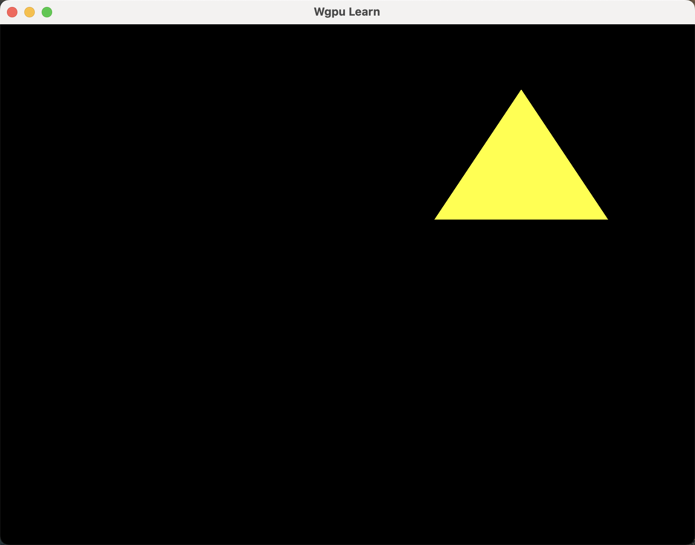

## 四、WebGPU 基础入门——Uniform 缓冲区与内存对齐

上一节，我们通过 `WebGPU` 创建了一个简单的三角形，并渲染到屏幕上。这节我们将学习如何使用 `Uniform` 缓冲区传递数据到着色器中。

### 1. Uniform 缓冲区

Uniform缓冲区是一种用于存储着色器中共享的全局统一数据的机制，支持在单次绘制调用中被所有着色器阶段读取使用，但不允许写入。

常见用法是传递一些不需要频繁更新的数据，比如：

- 物体的变换矩阵（模型矩阵、视图矩阵、投影矩阵）。
- 光照参数（光源位置、颜色、强度）。
- 材质参数（漫反射系数、镜面反射系数）。
- 纹理采样器（纹理单元、过滤模式、包裹模式）。
- 动画参数（动画时间、帧数）。
- 其他全局状态（如时间、帧数、视口大小等）。

---

### 2. 实战

首先，在`uniform.wgsl`中，我们先声明一个结构体。

```wgsl
struct Params {
    color: vec4f,
    offset: vec2f,
    scale: f32,
}
```

然后，我们声明了一个类型为该结构体的`uniform`变量。变量名为`params`，类型为`Params`。

```wgsl
@group(0) @binding(0) var<uniform> params: Params;
```

然后我们更改顶点着色器返回的内容，以使用 uniforms。

```wgsl
struct VertexOutput {
    @builtin(position) position: vec4f,
}

@vertex
fn vs(@builtin(vertex_index) vertex_index: u32) -> VertexOutput {
    var pos = array(
        vec2f(0.0, 0.5),
        vec2f(-0.5, -0.5),
        vec2f(0.5, -0.5),
    );

    var output = VertexOutput(
        vec4f(pos[vertex_index] * params.scale + params.offset, 0.0, 1.0),
    );

    return output;
}

```

可以看到，我们将顶点位置乘以 scale，然后加上 offset。这样我们就可以设置三角形的大小并对其进行定位。

我们还修改了片段着色器，以返回 uniforms 的颜色

```wgsl
@fragment
fn fs() -> @location(0) vec4f {
    return params.color;
}
```

然后在`rs-wgpu-learn/src/lib.rs`中新建结构体。

```rust
#[repr(C)]
#[derive(Debug, PartialEq, Clone, Copy, bytemuck::Pod, bytemuck::Zeroable)]
pub struct Params {
    pub color: [f32; 4],
    pub offset: [f32; 2],
    pub scale: f32,
}
```

修改`WgpuApp`添加`bind_group`字段。

```rust
pub struct WgpuApp {
    pub window: Arc<Window>,
    pub surface: wgpu::Surface<'static>,
    pub device: wgpu::Device,
    pub queue: wgpu::Queue,
    pub config: wgpu::SurfaceConfiguration,
    pub pipeline: wgpu::RenderPipeline,
    pub bind_group: wgpu::BindGroup, // 添加bind_group字段
}
```

接着创建`Uniform`缓冲区

```rust
impl WgpuApp {
    pub async fn new(window: Arc<Window>) -> Result<Self> {
        // ...
        // 修改导入wgsl文件的路径
        let shader = device.create_shader_module(include_wgsl!("../../source/uniform.wgsl"));

        // ...
        // 新增
        let params = Params {
            color: [1.0, 1.0, 0.0, 1.0],
            offset: [0.5, 0.5],
            scale: 0.5,
        };

        let buffer = device.create_buffer_init(&wgpu::util::BufferInitDescriptor {
            label: Some("Uniform Buffer"),
            contents: bytemuck::bytes_of(&params),
            usage: wgpu::BufferUsages::UNIFORM | wgpu::BufferUsages::COPY_DST,
        });

        let bind_group = device.create_bind_group(&wgpu::BindGroupDescriptor {
            label: None,
            layout: &pipeline.get_bind_group_layout(0),
            entries: &[wgpu::BindGroupEntry {
                binding: 0,
                resource: buffer.as_entire_binding(),
            }],
        });

        Ok(Self {
            window,
            surface,
            device,
            queue,
            config,
            pipeline,
            bind_group,
        })
    }
}

```

然后在渲染流程中使用`bind_group`

```rust

pub fn render(&mut self) -> Result<()> {
    // ...
    {
        let mut pass = encoder.begin_render_pass(&wgpu::RenderPassDescriptor {
            label: Some("Render Pass"),
            color_attachments: &[Some(wgpu::RenderPassColorAttachment {
                view: &view,
                ops: wgpu::Operations {
                    load: wgpu::LoadOp::Clear(Color::BLACK),
                    store: wgpu::StoreOp::Store,
                },
                resolve_target: None,
            })],
            depth_stencil_attachment: None,
            timestamp_writes: None,
            occlusion_query_set: None,
        });

        pass.set_pipeline(&self.pipeline);

        // 设置绑定组
        pass.set_bind_group(0, &self.bind_group, &[]);

        pass.draw(0..3, 0..1);
    }


    //...

    Ok(())
}
```

然后`cargo run`运行程序，不出意外，可以看到下面报错。



这是由于WebGPU数据内存布局导致的。建议先阅读[WebGPU Memory Layout](https://github.com/gfx-rs/wgpu/blob/master/wgpu/docs/src/memory-management.md)

#### WebGPU 内存对齐规则

以下是 WGSL 内存对齐的核心规则总结，按数据类型分类整理：

**1. 基本类型对齐规则**

• **标量类型**：对齐值等于自身字节大小（均为 2 的幂次）。  
  • `i32`/`u32`/`f32` → 4 字节
  • `f16` → 2 字节
• **向量类型**：对齐值为元素类型大小的 2 的幂次向上取整。  
  • `vec2<f32>` → 8 字节（元素类型 4 字节 × 2）
  • `vec3<f32>` → 16 字节（因存储缓冲区特殊规则）
• **矩阵类型**：每列对齐到对应向量类型的对齐值。  
  • `mat3x3<f32>` 每列 `vec3<f32>` → 对齐到 16 字节

**2. 结构体对齐规则**

• **成员对齐**：  
  • 首个成员偏移量为 0，后续成员偏移量必须是其类型对齐值的整数倍。  
  • 示例：`struct { f32 a; vec2<f32> b; }` 中，`a` 占 4 字节后需填充 4 字节，使 `b` 偏移 8 字节。
• **整体对齐**：结构体总大小必须是其成员最大对齐值的整数倍。  
  • 示例：若最大对齐值为 16，则结构体大小需向上填充至 16 的倍数（如 12→16）。

**3. 数组对齐规则**

• **元素间隔（Stride）**：等于元素类型的对齐值。  
  • `array<vec3<f32>>` 每个元素间隔为 16 字节（12 字节数据 + 4 字节填充）。

---

`Params` 结构体的字段及其类型如下：

- **`color: [f32; 4]`**
  - 类型：`vec4<f32>`
  - 大小：16 字节（4 个 `f32` 每个占 4 字节）
  - 对齐：16 字节（`vec4<f32>` 的对齐要求）
  - 偏移量：0 字节（结构体的第一个字段，偏移量从 0 开始）
- **`offset: [f32; 2]`**
  - 类型：`vec2<f32>`
  - 大小：8 字节（2 个 `f32` 每个占 4 字节）
  - 对齐：8 字节（`vec2<f32>` 的对齐要求）
  - 偏移量：16 字节（前一个字段 `color` 的大小为 16 字节，满足对齐要求）
- **`scale: f32`**
  - 类型：`f32`
  - 大小：4 字节
  - 对齐：4 字节（`f32` 的对齐要求）
  - 偏移量：24 字节（前一个字段 `offset` 的大小为 8 字节，满足对齐要求）
  - 补全： `scale` 之后需要填充 4 字节，以满足结构体整体对齐要求（最大对齐值为 16 字节）。

参考下图



然后修改`Params` 结构体，添加补全字段 `_pad_scale`，并将其对齐到 16 字节。

```rust
#[repr(C, align(16))]
#[derive(Debug, PartialEq, Clone, Copy, bytemuck::Pod, bytemuck::Zeroable)]
pub struct Params {
    /// size: 16, offset: 0, type: `vec4<f32>`
    pub color: [f32; 4],
    /// size: 8, offset: 16 (2*8), type: `vec2<f32>`
    pub offset: [f32; 2],
    /// size: 4, offset: 24 (4*6), type: `f32`
    pub scale: f32,
    pub _pad_scale: [u8; 0x8 - core::mem::size_of::<f32>()],
}

impl Params {
    pub const fn new(color: [f32; 4], offset: [f32; 2], scale: f32) -> Self {
        Self {
            color,
            offset,
            scale,
            _pad_scale: [0; 0x8 - core::mem::size_of::<f32>()],
        }
    }
}

impl WgpuApp {
    /// 异步构造函数：初始化WebGPU环境
    pub async fn new(window: Arc<Window>) -> Result<Self> {

        // ...
        // 使用new函数创建Params
        let params = Params::new([1.0, 1.0, 0.0, 1.0], [0.5, 0.5], 0.5);

        let buffer = device.create_buffer_init(&wgpu::util::BufferInitDescriptor {
            label: Some("Uniform Buffer"),
            contents: bytemuck::bytes_of(&params),
            usage: wgpu::BufferUsages::UNIFORM | wgpu::BufferUsages::COPY_DST,
        });

        // ...
    }

}

```

然后`cargo run`运行，不出意外，可以得到一个黄色的三角形。



这时候，可能有同学会问了，博主博主，你的内存布局计算太难了，有没有更简单又好用的方法。
有的，兄弟有的，经过我的调研，发现一个非常好用的库叫[wgsl-bindgen](https://crates.io/crates/wgsl_bindgen)。有兴趣的可以查看文档，这里就不详细介绍了。

接下来介绍在typescript中使用`Uniform`缓冲区。
首先安装依赖：

```bash
pnpm add webgpu-utils
```

然后创建`Uniform`缓冲区以及绑定组，最后在渲染流程中使用绑定组。
逻辑与上面rust版本一样，这里就不再赘述了。
具体代码如下：

```ts
import "./style.css";
import uniformWgsl from "../../source/uniform.wgsl?raw";
import { makeShaderDataDefinitions, makeStructuredView } from "webgpu-utils";

class WebGPUApp {
  constructor(
    public device: GPUDevice,
    public queue: GPUQueue,
    public canvas: HTMLCanvasElement,
    public ctx: GPUCanvasContext,
    public pipeline: GPURenderPipeline,
    public bindGroup: GPUBindGroup
  ) {
    const observer = new ResizeObserver((entries) => {
      for (const entry of entries) {
        const canvas = entry.target as HTMLCanvasElement;
        const width = entry.contentBoxSize[0].inlineSize;
        const height = entry.contentBoxSize[0].blockSize;
        canvas.width = Math.min(width, device.limits.maxTextureDimension2D);
        canvas.height = Math.min(height, device.limits.maxTextureDimension2D);
      }
    });
    observer.observe(canvas);
  }

  public static async create() {
    const adapter = await navigator.gpu.requestAdapter();
    // 请求GPU设备
    const device = await adapter?.requestDevice();
    if (!device) {
      throw new Error("Couldn't request WebGPU device");
    }

    // 创建画布元素
    const canvas = document.createElement("canvas");
    document.querySelector("#app")?.appendChild(canvas);

    // 获取WebGPU上下文
    const ctx = canvas.getContext("webgpu");
    if (!ctx) {
      throw new Error("Couldn't get WebGPU context");
    }

    // 获取首选画布格式
    const preferredFormat = navigator.gpu.getPreferredCanvasFormat();

    // 配置画布上下文
    ctx.configure({
      device,
      format: preferredFormat,
    });

    // 创建着色器模块
    const shader = device.createShaderModule({
      code: uniformWgsl, // 加载 WGSL 着色器代码
    });

    // 创建渲染管线
    const pipeline = device.createRenderPipeline({
      layout: "auto",
      vertex: {
        module: shader,
        entryPoint: "vs", // 顶点着色器入口
      },
      fragment: {
        module: shader,
        entryPoint: "fs", // 片元着色器入口
        targets: [
          {
            format: preferredFormat, // 渲染目标格式
          },
        ],
      },
    });

    // 使用工具函数解析着色器中的 uniform 数据定义
    const defs = makeShaderDataDefinitions(uniformWgsl);
    const params = makeStructuredView(defs.uniforms.params);

    // 设置 uniform 数据的初始值
    params.set({
      color: [1.0, 1.0, 0, 1], // 设置颜色为黄色
      scale: 0.5, // 缩放因子
      offset: [0.5, 0.5], // 偏移量
    });

    // 创建 GPU 缓冲区以存储 uniform 数据
    const buffer = device.createBuffer({
      size: params.arrayBuffer.byteLength, // 缓冲区大小与 uniform 数据大小一致
      usage: GPUBufferUsage.UNIFORM | GPUBufferUsage.COPY_DST, // 用作 uniform 缓冲区并支持写入
    });

    // 将 uniform 数据写入缓冲区
    device.queue.writeBuffer(buffer, 0, params.arrayBuffer);

    // 创建绑定组，将 uniform 缓冲区绑定到着色器
    const bindGroup = device.createBindGroup({
      layout: pipeline.getBindGroupLayout(0), // 获取绑定组布局
      entries: [
        {
          binding: 0, // 对应着色器中的 binding 位置
          resource: {
            buffer, // 绑定 uniform 缓冲区
          },
        },
      ],
    });

    return new WebGPUApp(
      device,
      device.queue,
      canvas,
      ctx,
      pipeline,
      bindGroup
    );
  }

  public render() {
    const { device, ctx, pipeline, bindGroup } = this;
    // 创建命令编码器（用于记录一系列GPU执行命令）
    const encoder = device.createCommandEncoder();

    // 获取当前Canvas的输出纹理（WebGPU渲染目标）
    const output = ctx.getCurrentTexture();
    const view = output.createView(); // 创建纹理视图用于渲染目标绑定

    // 开始渲染通道配置
    const pass = encoder.beginRenderPass({
      colorAttachments: [
        // 配置颜色附件数组（此处仅使用一个主颜色目标）
        {
          view, // 绑定之前创建的纹理视图作为渲染目标
          clearValue: { r: 0, g: 0, b: 0, a: 1 }, // 设置清除颜色为黑色（RGB 0,0,0）
          loadOp: "clear", // 渲染前清除颜色缓冲区
          storeOp: "store", // 渲染完成后将结果存储到颜色缓冲区
        },
      ],
    });

    // 绑定当前渲染管线配置（顶点/片元着色器等）
    pass.setPipeline(pipeline);
    pass.setBindGroup(0, bindGroup); // 将 uniform 数据绑定到渲染管线
    // 执行绘制命令：绘制3个顶点构成的三角形
    // 参数3表示顶点数量（与顶点着色器中数组长度一致）
    pass.draw(3);

    // 结束当前渲染通道的配置
    pass.end();

    // 生成最终的命令缓冲区（包含所有已记录的渲染指令）
    const commandBuffer = encoder.finish(); // 修正拼写错误：commanderBuffer → commandBuffer
    device.queue.submit([commandBuffer]); // 将命令提交到GPU队列执行
  }
}

async function main() {
  const app = await WebGPUApp.create();

  // 使用 requestAnimationFrame 实现持续渲染
  const renderLoop = () => {
    app.render();
    requestAnimationFrame(renderLoop);
  };

  requestAnimationFrame(renderLoop);
}

// 调用主函数
main();

```
