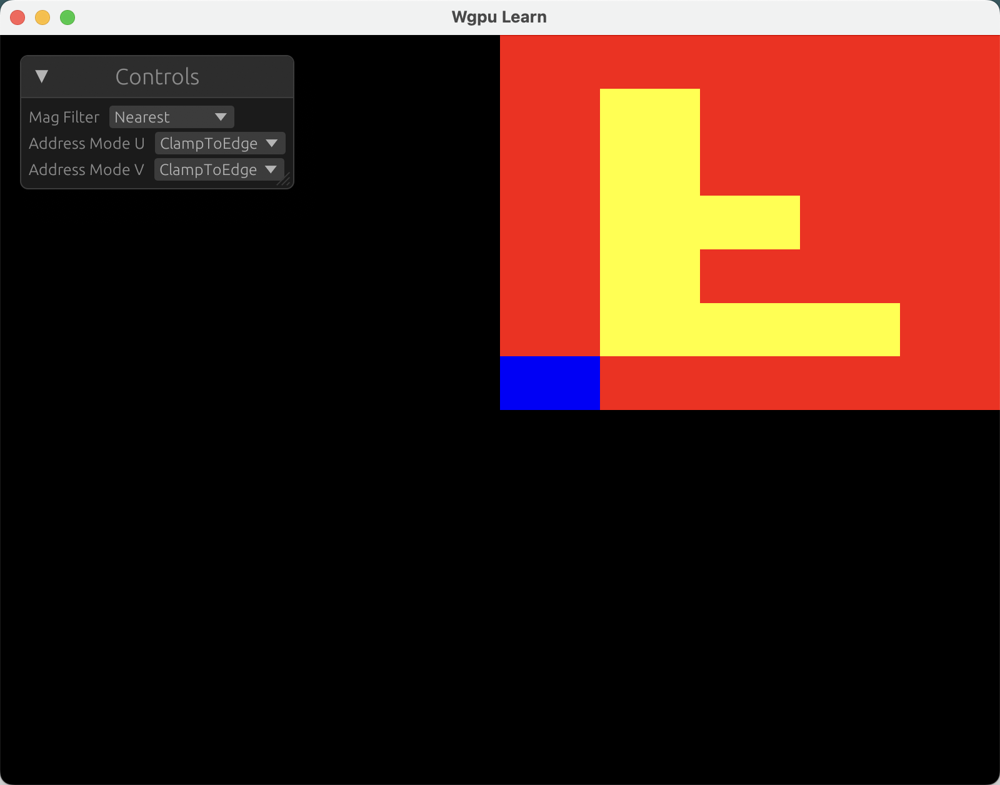
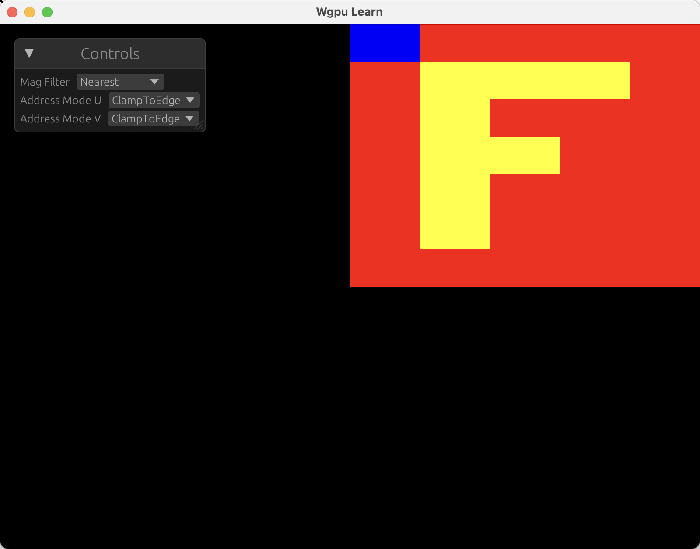

## 七、WebGPU 基础入门——Texture 纹理

之前，我们探讨了用于向着色器传递数据的关键数据类型`GPUBuffer`，这其中包括了`UniformBuffer`、`StorageBuffer`以及`VertexBuffer`等。今天我们将介绍向着色器传递数据的另一种主要方式——纹理(`Texture`)。由于作者精力有限，且网络上关于typescript 的代码案例比较多，所以后面的章节代码实践部分只用rust 编写。

### 什么是纹理？

纹理本质上是存储颜色值的多维数据结构（最常见为2D图像），但其核心价值并非仅作为二维数组存在。与直接使用存储缓冲区不同，纹理通过**采样器（Sampler）**这一专用硬件单元实现高效访问：采样器能够自动从纹理中读取相邻的多个像素值（最多可达16个），并根据采样位置进行插值混合，这在处理纹理过滤（如抗锯齿、缩放）、 mipmaps 或复杂采样模式时至关重要。

### 创建纹理

首先先创建`source/texture.wgsl`，我们将创建一个简单的纹理，并在片段着色器中对其进行采样：

```wgsl
struct VertexOutput {
    @builtin(position) position: vec4f,
    // 纹理坐标
    @location(0) texcoord: vec2f,
}

// 声明采样器
@group(0) @binding(0) var ourSampler: sampler;
// 声明纹理
@group(0) @binding(1) var ourTexture: texture_2d<f32>;

@vertex
fn vs(@builtin(vertex_index) vertex_index: u32) -> VertexOutput {
    let pos = array(
        // 1st triangle
        vec2f(0.0, 0.0), // center
        vec2f(1.0, 0.0), // right, center
        vec2f(0.0, 1.0), // center, top
        // 2st triangle
        vec2f(0.0, 1.0), // center, top
        vec2f(1.0, 0.0), // right, center
        vec2f(1.0, 1.0), // right, top
    );
    return VertexOutput(vec4f(pos[vertex_index], 0.0, 1.0), pos[vertex_index]);
}

@fragment
fn fs(in: VertexOutput) -> @location(0) vec4f {
    // 纹理采样
    // 第一个参数是纹理对象，第二个参数是采样器对象，第三个参数是纹理坐标
    return textureSample(ourTexture, ourSampler, in.texcoord);
}
```

然后在`lib.rs`中：
编写工具函数`gen_texture_data`,用于创建一个 5x7 的像素化 F。

```rust
fn gen_texture_data() -> Vec<u8> {
    let red = [255u8, 0, 0, 255]; // 红色
    let yellow = [255, 255, 0, 255]; // 黄色
    let blue = [0, 0, 255, 255]; // 蓝色

    // 定义二维纹理数据结构
    let rows = [
        [blue, red, red, red, red],         // 第一行
        [red, yellow, yellow, yellow, red], // 第二行
        [red, yellow, red, red, red],       // 第三行
        [red, yellow, yellow, red, red],    // 第四行
        [red, yellow, red, red, red],       // 第五行
        [red, yellow, red, red, red],       // 第六行
        [red, red, red, red, red],          // 第七行
    ];

    // 将二维数组展平为一维字节数组
    rows.iter().flatten().flatten().copied().collect()
}
```

接下来我们在`WgpuApp::new`中创建纹理：

```rust
// ...
let texture_data = gen_texture_data();
// 纹理大小
let texture_size = wgpu::Extent3d {
    width: 5,
    height: 7,
    ..Default::default()
};
// 创建纹理
let texture = device.create_texture(&wgpu::TextureDescriptor {
    label: Some("texture"),
    size: texture_size,
    format: wgpu::TextureFormat::Rgba8Unorm,
    usage: wgpu::TextureUsages::TEXTURE_BINDING | wgpu::TextureUsages::COPY_DST,
    mip_level_count: 1,
    sample_count: 1,
    dimension: wgpu::TextureDimension::D2,
    view_formats: &[],
});

// 将数据写入纹理
queue.write_texture(
    wgpu::TexelCopyTextureInfoBase {
        texture: &texture,
        mip_level: 0,
        origin: wgpu::Origin3d::ZERO,
        aspect: wgpu::TextureAspect::All,
    },
    &texture_data,
    wgpu::TexelCopyBufferLayout {
        offset: 0,
        bytes_per_row: Some(texture_size.width * 4),
        rows_per_image: None,
    },
    texture_size,
);

// 创建采样器
let sampler = device.create_sampler(&wgpu::SamplerDescriptor::default());
// 创建绑定组
let bind_group = device.create_bind_group(&wgpu::BindGroupDescriptor {
    label: None,
    layout: &pipeline.get_bind_group_layout(0),
    entries: &[
        wgpu::BindGroupEntry {
            binding: 0,
            resource: wgpu::BindingResource::Sampler(&sampler),
        },
        wgpu::BindGroupEntry {
            binding: 1,
            resource: wgpu::BindingResource::TextureView(
                &texture.create_view(&Default::default()),
            ),
        },
    ],
});

// ...
```

我们创建了一个 `Rgba8Unorm` 纹理。rgba8unorm 表示纹理将有有红、绿、蓝和 alpha 值。每个值都是 8 位无符号值，并且在纹理中使用时将进行归一化处理。unorm 表示 unsigned normalized。意思是 “无符号归一化”，它将 0~255 的值转换为 0.0~1.0 之间的浮点数值。

换句话说，如果我们在纹理中输入的值是[64, 128, 192, 255]，那么着色器中的值最终将是[64 / 255, 128 / 255, 192 / 255, 255 / 255]。或者换一种说法，在 shader 中最终的值是[0.25, 0.50, 0.75, 1.00]。

然后在`render`函数中绑定纹理：

```rust
// 设置绑定组
pass.set_bind_group(0, &self.bind_group, &[]);
// 绘制矩形
pass.draw(0..6, 0..1);
```

然后运行可以看到一个倒着的F出现在画面中



为什么是倒的？
因为画布的坐标系与纹理的坐标系不同。画布的原点是画布的中心点，而纹理的原点是左上角。常见的解决方法是翻转纹理数据。

```rust
fn gen_texture_data() -> Vec<u8> {
    let red = [255u8, 0, 0, 255]; // 红色
    let yellow = [255, 255, 0, 255]; // 黄色
    let blue = [0, 0, 255, 255]; // 蓝色

    // // 定义二维纹理数据结构
    // let rows = [
    //     [blue, red, red, red, red],         // 第一行
    //     [red, yellow, yellow, yellow, red], // 第二行
    //     [red, yellow, red, red, red],       // 第三行
    //     [red, yellow, yellow, red, red],    // 第四行
    //     [red, yellow, red, red, red],       // 第五行
    //     [red, yellow, red, red, red],       // 第六行
    //     [red, red, red, red, red],          // 第七行
    // ];

    // 定义二维纹理数据结构并翻转
    let rows = [
        [red, red, red, red, red],          // 第七行
        [red, yellow, red, red, red],       // 第六行
        [red, yellow, red, red, red],       // 第五行
        [red, yellow, yellow, red, red],    // 第四行
        [red, yellow, red, red, red],       // 第三行
        [red, yellow, yellow, yellow, red], // 第二行
        [blue, red, red, red, red],         // 第一行
    ];

    // 将二维数组展平为一维字节数组
    rows.iter().flatten().flatten().copied().collect()
}
```

运行后可以看到 F 变成了正常的方向。



你可能已经注意到，我的图片左上角有一个悬浮窗，这是 `egui` 提供的一个小部件。`egui` 是一个用 Rust 编写的即时模式（Immediate Mode）图形用户界面库，我在这里用它实现了一些小控件，方便我们进行学习和演示。

在后面的章节中，我们将使用 `egui` 来实现一些简单的 UI 界面，帮助我们更好地理解 WebGPU 的使用。
