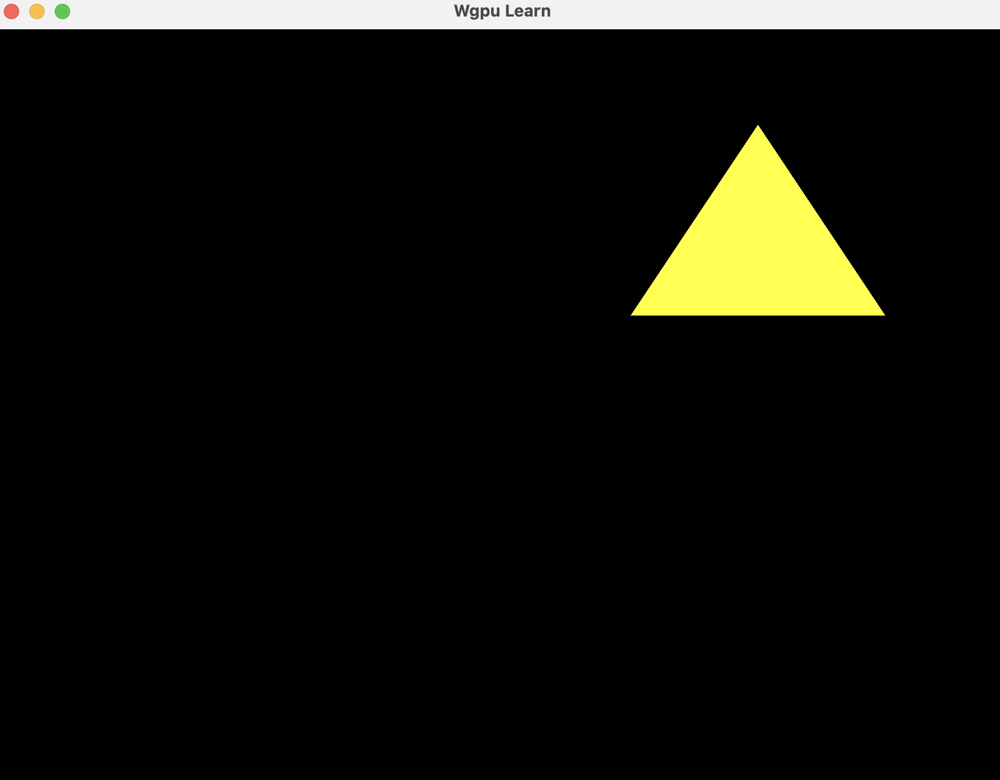
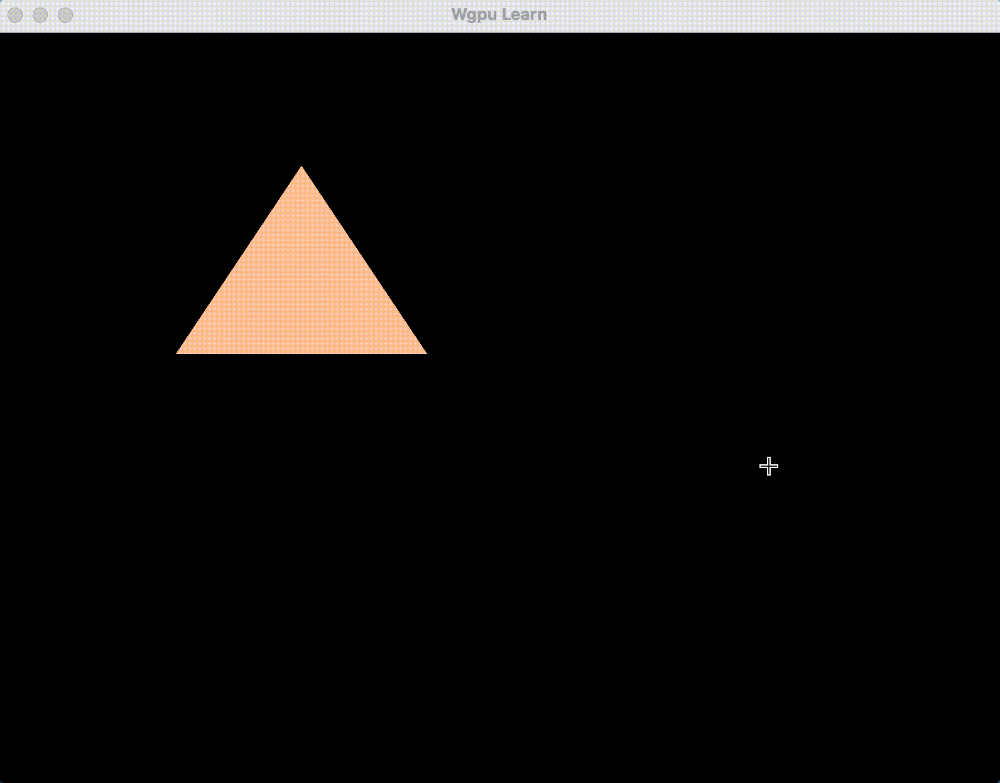
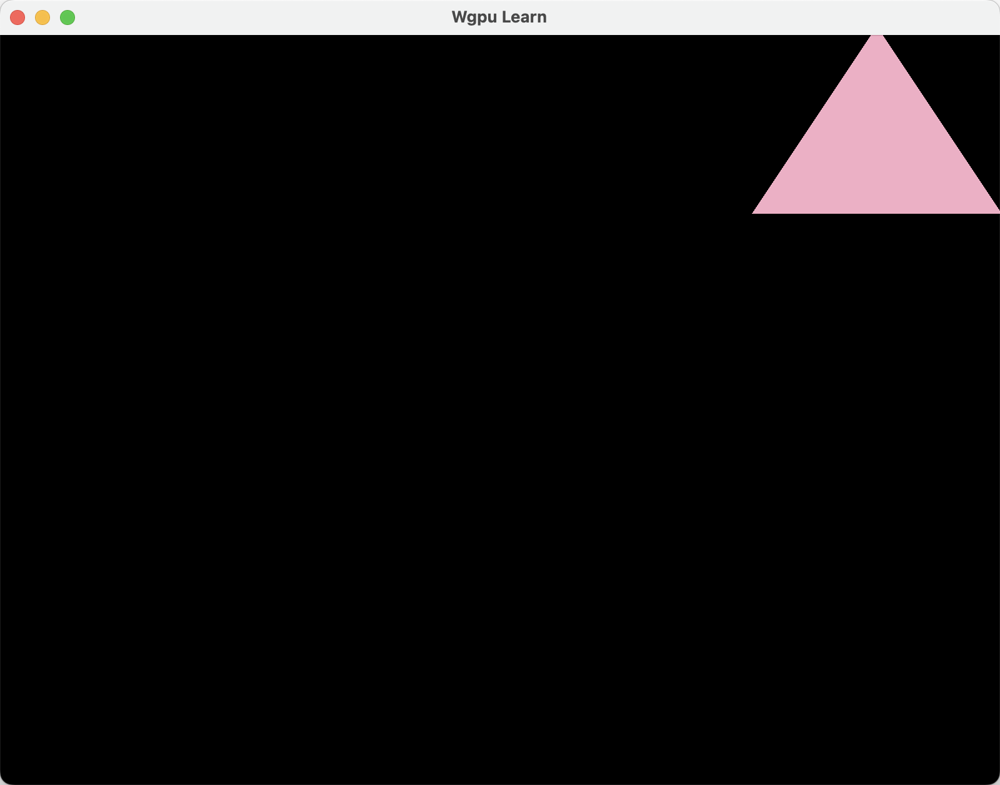
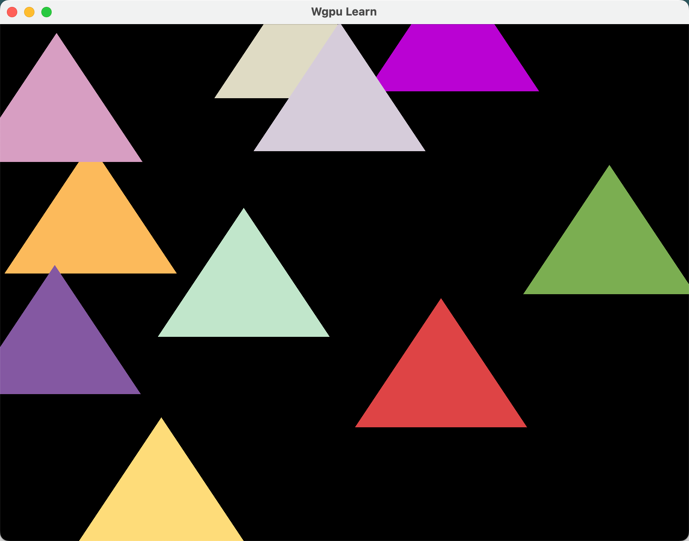

## 五、WebGPU 基础入门——Storage 缓冲区

WebGPU中的Storage缓冲区是一种允许着色器读写、存储动态数据的缓冲区，适用于需要修改或处理大规模数据的场景（如计算着色器、粒子系统）。这一节我们将使用Storage缓冲区绘制10个不同位置颜色的三角形。

### 1.创建Storage缓冲区

首先修改`uniform.wgsl`文件,将`params`变量的声明从uniform改为storage：

```wgsl
// @group(0) @binding(0) var<uniform> params: Params;
@group(0) @binding(0) var<storage> params: Params;
```

然后修改创建缓冲区的代码
将`wgpu::BufferUsages::UNIFORM`改为`wgpu::BufferUsages::STORAGE`：

```rust
let buffer = device.create_buffer_init(&wgpu::util::BufferInitDescriptor {
    label: Some("Uniform Buffer"),
    contents: bytemuck::bytes_of(&params),
    usage: wgpu::BufferUsages::STORAGE | wgpu::BufferUsages::COPY_DST,
});

```

在typescript中同样只需要将`GPUBufferUsage.STORAGE`改成`GPUBufferUsage.STORAGE`即可：

```typescript
// ...

const defs = makeShaderDataDefinitions(storageWgsl);
// 注意，这里也要使用 storages 而不是 uniforms
const params = makeStructuredView(defs.storages.params);

// ...

const buffer = device.createBuffer({
  size: params.arrayBuffer.byteLength,
  usage: GPUBufferUsage.STORAGE | GPUBufferUsage.COPY_DST,
});

//...
```

然后运行

```bash
cargo run
```



经过上面的修改，我们已经成功创建了一个Storage缓冲区，并将其绑定到着色器中。细心的你可能已经发现，Storage缓冲区的使用和Uniform缓冲区几乎没有区别。它们的主要区别在于Storage缓冲区允许着色器读写数据，而Uniform缓冲区只能读取数据。另一个区别是Storage缓冲区的大小比较大，通常用于存储大量数据，而Uniform缓冲区适合存储小量数据（如变换矩阵、光照参数等）。

### 2.实例化绘制

接下来我们将探讨如何高效且易用的方式绘制多个实例。

初学者可能会想到通过for循环来绘制多个实例。例如：

```rust
#[repr(C, align(16))]
#[derive(Debug, PartialEq, Clone, Copy, bytemuck::Pod, bytemuck::Zeroable)]
pub struct Params {
    /// size: 16, offset: 0, type: `vec4<f32>`
    pub color: [f32; 4],
    /// size: 8, offset: 16 (2*8), type: `vec2<f32>`
    pub offset: [f32; 2],
    /// size: 4, offset: 24 (4*6), type: `f32`
    pub scale: f32,
    pub _pad_scale: [u8; 0x8 - core::mem::size_of::<f32>()],
}

impl Params {
    pub const fn new(color: [f32; 4], offset: [f32; 2], scale: f32) -> Self {
        Self {
            color,
            offset,
            scale,
            _pad_scale: [0; 0x8 - core::mem::size_of::<f32>()],
        }
    }

    // 随机生成参数
    pub fn random() -> Self {
        // 随机生成颜色
        let color = [
            rand::random_range(0.0..=1.0),
            rand::random_range(0.0..=1.0),
            rand::random_range(0.0..=1.0),
            1.0,
        ];
        // 随机生成偏移量
        let offset = [
            rand::random_range(-1.0..=1.0),
            rand::random_range(-1.0..=1.0),
        ];
        let scale = 0.5;

        Self {
            color,
            offset,
            scale,
            _pad_scale: [0; 0x8 - core::mem::size_of::<f32>()],
        }
    }
}


pub struct WgpuApp {
    // ...
    pub bind_group: wgpu::BindGroup,
    pub buffer: wgpu::Buffer,// 存储数据的缓冲区
}


impl WgpuApp {
    pub async fn new(window: Arc<Window>) -> Result<Self> {
        // ...

        let params = Params::new([1.0, 1.0, 0.0, 1.0], [0.5, 0.5], 0.5);

        let buffer = device.create_buffer_init(&wgpu::util::BufferInitDescriptor {
            label: Some("Uniform Buffer"),
            contents: bytemuck::bytes_of(&params),
            usage: wgpu::BufferUsages::STORAGE | wgpu::BufferUsages::COPY_DST,
        });

        let bind_group = device.create_bind_group(&wgpu::BindGroupDescriptor {
            label: None,
            layout: &pipeline.get_bind_group_layout(0),
            entries: &[wgpu::BindGroupEntry {
                binding: 0,
                resource: buffer.as_entire_binding(),
            }],
        });

        Ok(Self {
            window,
            surface,
            device,
            queue,
            config,
            pipeline,
            bind_group,
            buffer,// 新增
        })
    }

    /// 执行渲染操作
    pub fn render(&mut self) -> Result<()> {
        // 1. 获取当前帧缓冲区
        let output = self.surface.get_current_texture()?;

        // 2. 创建纹理视图
        let view = output
            .texture
            .create_view(&wgpu::TextureViewDescriptor::default());

        // 3. 创建命令编码器
        let mut encoder = self
            .device
            .create_command_encoder(&wgpu::CommandEncoderDescriptor::default());

        // 4. 开始渲染通道
        {
            let mut pass = encoder.begin_render_pass(&wgpu::RenderPassDescriptor {
                label: Some("Render Pass"),
                color_attachments: &[Some(wgpu::RenderPassColorAttachment {
                    view: &view,
                    ops: wgpu::Operations {
                        load: wgpu::LoadOp::Clear(Color::BLACK), // 用黑色清除背景
                        store: wgpu::StoreOp::Store,             // 存储渲染结果
                    },
                    resolve_target: None,
                })],
                depth_stencil_attachment: None,
                timestamp_writes: None,
                occlusion_query_set: None,
            });

            // 5. 设置渲染管线
            pass.set_pipeline(&self.pipeline);

            // 渲染10个不同位置颜色的三角形(错误案例)
            for _ in 0..10 {
                self.queue
                    .write_buffer(&self.buffer, 0, bytemuck::cast_slice(&[Params::random()]));
                // 6. 设置绑定组
                pass.set_bind_group(0, &self.bind_group, &[]);

                // 7. 绘制调用（绘制三角形）
                pass.draw(0..3, 0..1);
            }

            // // 6. 设置绑定组
            // pass.set_bind_group(0, &self.bind_group, &[]);

            // // 7. 绘制调用（绘制三角形）
            // pass.draw(0..3, 0..1);
        }

        // 7. 提交命令到队列
        let command_buffer = encoder.finish();
        self.queue.submit(std::iter::once(command_buffer));

        // 8. 呈现渲染结果
        output.present();

        Ok(())
    }
}

```

然后运行

```bash
cargo run
```



观察可以发现屏幕中的三角形一直在闪烁，这是因为我们在render函数中绘制三角形的Params参数是随机生成的，每次绘制三角形时都在重新生成参数，导致三角形的颜色和位置不断变化。我们可以在create时生成10个随机的Params参数，然后在render函数中将这些参数传递给着色器进行绘制。这样就可以避免每次绘制都重新生成参数。

```rust

// Wgpu应用核心结构体
pub struct WgpuApp {
    // ...
    pub buffer: wgpu::Buffer,
    pub params_list: Vec<Params>,//新增
}

impl WgpuApp {
    pub async fn new(window: Arc<Window>) -> Result<Self> {
        // ...

        let params = Params::new([1.0, 1.0, 0.0, 1.0], [0.5, 0.5], 0.5);

        let buffer = device.create_buffer_init(&wgpu::util::BufferInitDescriptor {
            label: Some("Uniform Buffer"),
            contents: bytemuck::bytes_of(&params),
            usage: wgpu::BufferUsages::STORAGE | wgpu::BufferUsages::COPY_DST,
        });

        let bind_group = device.create_bind_group(&wgpu::BindGroupDescriptor {
            label: None,
            layout: &pipeline.get_bind_group_layout(0),
            entries: &[wgpu::BindGroupEntry {
                binding: 0,
                resource: buffer.as_entire_binding(),
            }],
        });

        let params_list = (0..10).map(|_| Params::random()).collect::<Vec<_>>();

        Ok(Self {
            //...
            buffer,
            params_list,
        })
    }

    /// 执行渲染操作
    pub fn render(&mut self) -> Result<()> {
        // 1. 获取当前帧缓冲区
        let output = self.surface.get_current_texture()?;

        // 2. 创建纹理视图
        let view = output
            .texture
            .create_view(&wgpu::TextureViewDescriptor::default());

        // 3. 创建命令编码器
        let mut encoder = self
            .device
            .create_command_encoder(&wgpu::CommandEncoderDescriptor::default());

        // 4. 开始渲染通道
        {
            let mut pass = encoder.begin_render_pass(&wgpu::RenderPassDescriptor {
                label: Some("Render Pass"),
                color_attachments: &[Some(wgpu::RenderPassColorAttachment {
                    view: &view,
                    ops: wgpu::Operations {
                        load: wgpu::LoadOp::Clear(Color::BLACK), // 用黑色清除背景
                        store: wgpu::StoreOp::Store,             // 存储渲染结果
                    },
                    resolve_target: None,
                })],
                depth_stencil_attachment: None,
                timestamp_writes: None,
                occlusion_query_set: None,
            });

            // 5. 设置渲染管线
            pass.set_pipeline(&self.pipeline);

            // 错误案例
            for param in &self.params_list {
                self.queue
                    .write_buffer(&self.buffer, 0, bytemuck::bytes_of(param));
                // 6. 设置绑定组
                pass.set_bind_group(0, &self.bind_group, &[]);

                // 7. 绘制调用（绘制三角形）
                pass.draw(0..3, 0..1);
            }

            // // 6. 设置绑定组
            // pass.set_bind_group(0, &self.bind_group, &[]);

            // // 7. 绘制调用（绘制三角形）
            // pass.draw(0..3, 0..1);
        }

        // 7. 提交命令到队列
        let command_buffer = encoder.finish();
        self.queue.submit(std::iter::once(command_buffer));

        // 8. 呈现渲染结果
        output.present();

        Ok(())
    }
}

```



当我们运行程序时，发现屏幕上只有一个三角形，这是因为queue.xxx 函数发生在 queue 中，而 pass.xxx 函数只是对命令缓冲区中的命令进行编码。当我们使用命令缓冲区实际调用submit时，缓冲区中唯一的内容就是我们最后写入的值。

因此我们需要在每次绘制三角形时都使用不同的绑定组，这样才能保证每个三角形都有自己的参数。

```rust
// Wgpu应用核心结构体
pub struct WgpuApp {
    pub window: Arc<Window>,                // 窗口对象
    pub surface: wgpu::Surface<'static>,    // GPU表面（用于绘制到窗口）
    pub device: wgpu::Device,               // GPU设备抽象
    pub queue: wgpu::Queue,                 // 命令队列（用于提交GPU命令）
    pub config: wgpu::SurfaceConfiguration, // 表面配置（格式、尺寸等）
    pub pipeline: wgpu::RenderPipeline,     // 渲染管线（包含着色器、状态配置等）
    // pub bind_group: wgpu::BindGroup, // 删除
    // pub buffer: wgpu::Buffer, // 删除
    // pub params_list: Vec<Params>, // 删除
    pub bind_groups: Vec<wgpu::BindGroup>,// 新增
}

impl WgpuApp {
    /// 异步构造函数：初始化WebGPU环境
    pub async fn new(window: Arc<Window>) -> Result<Self> {
        // ...

        let bind_groups = (0..10)
            .map(|_| {
                let buffer = device.create_buffer_init(&wgpu::util::BufferInitDescriptor {
                    label: Some("Uniform Buffer"),
                    contents: bytemuck::bytes_of(&Params::random()),
                    usage: wgpu::BufferUsages::STORAGE | wgpu::BufferUsages::COPY_DST,
                });

                device.create_bind_group(&wgpu::BindGroupDescriptor {
                    label: None,
                    layout: &pipeline.get_bind_group_layout(0),
                    entries: &[wgpu::BindGroupEntry {
                        binding: 0,
                        resource: buffer.as_entire_binding(),
                    }],
                })
            })
            .collect::<Vec<_>>();

        Ok(Self {
            window,
            surface,
            device,
            queue,
            config,
            pipeline,
            // bind_group,
            // buffer,
            // params_list,
            bind_groups,
        })
    }

    /// 执行渲染操作
    pub fn render(&mut self) -> Result<()> {
        // ...

        // 4. 开始渲染通道
        {

            // ...

            for bind_group in &self.bind_groups {
                // self.queue
                //     .write_buffer(&self.buffer, 0, bytemuck::bytes_of(param));
                // 6. 设置绑定组
                pass.set_bind_group(0, bind_group, &[]);

                // 7. 绘制调用（绘制三角形）
                pass.draw(0..3, 0..1);
            }
        }

        // ...

        Ok(())
    }
}
```

然后运行，可以看到屏幕上有10个不同位置颜色的三角形。



呼，终于画出了10个三角形。但是这个方法不够优雅，有没有更好的方法呢？
有的，兄弟有的！我们可以使用实例化绘制来绘制多个实例。实例化绘制（Instanced Drawing）是一种技术，它允许通过单次绘制命令来渲染同一个几何体的多个实例。每个实例可以应用不同的变换或其他属性，从而高效地绘制大量相似但不完全相同的物体。这种方法能够显著减少API调用的开销，并提高渲染性能。

接下来我们具体看看如何使用实例化绘制来绘制多个三角形。
首先修改`wgsl`文件：

```wgsl
struct Params {
    color: vec4f,
    offset: vec2f,
    scale: f32,
}

// 将原来的params改为params_list，并将其声明为数组
@group(0) @binding(0) var<storage> params_list: array<Params>;

struct VertexOutput {
    @builtin(position) position: vec4f,
    // 新增color属性，片段着色器中访问不到 @builtin(instance_index)
    @location(0) color: vec4f,
}

@vertex
fn vs(@builtin(vertex_index) vertex_index: u32,
// 新增参数，表示实例索引
// 这里的instance_index是一个内置变量，表示当前实例的索引
@builtin(instance_index) instance_index: u32) -> VertexOutput {
    var pos = array(
        vec2f(0.0, 0.5),
        vec2f(-0.5, -0.5),
        vec2f(0.5, -0.5),
    );

    // 使用instance_index来选择params_list中的参数
    let params = params_list[instance_index];

    var output = VertexOutput(
        vec4f(pos[vertex_index] * params.scale + params.offset, 0.0, 1.0),
        params.color,
    );

    return output;
}


@fragment
fn fs(vsOutput: VertexOutput) -> @location(0) vec4f {
    return vsOutput.color;
}

```

然后修改`WgpuApp::new`函数，创建一个包含10个实例的缓冲区：

```rust
// Wgpu应用核心结构体
pub struct WgpuApp {
    pub window: Arc<Window>,                // 窗口对象
    pub surface: wgpu::Surface<'static>,    // GPU表面（用于绘制到窗口）
    pub device: wgpu::Device,               // GPU设备抽象
    pub queue: wgpu::Queue,                 // 命令队列（用于提交GPU命令）
    pub config: wgpu::SurfaceConfiguration, // 表面配置（格式、尺寸等）
    pub pipeline: wgpu::RenderPipeline,     // 渲染管线（包含着色器、状态配置等）
    pub bind_group: wgpu::BindGroup,
    pub instance_length: u32,
}

impl WgpuApp {
    /// 异步构造函数：初始化WebGPU环境
    pub async fn new(window: Arc<Window>) -> Result<Self> {
        // ...

        let instance_length = 10;
        let params_list = (0..instance_length)
            .map(|_| Params::random())
            .collect::<Vec<_>>();

        let buffer = device.create_buffer_init(&wgpu::util::BufferInitDescriptor {
            label: Some("Uniform Buffer"),
            contents: bytemuck::cast_slice(&params_list),
            usage: wgpu::BufferUsages::STORAGE | wgpu::BufferUsages::COPY_DST,
        });

        let bind_group = device.create_bind_group(&wgpu::BindGroupDescriptor {
            label: None,
            layout: &pipeline.get_bind_group_layout(0),
            entries: &[wgpu::BindGroupEntry {
                binding: 0,
                resource: buffer.as_entire_binding(),
            }],
        });

        Ok(Self {
            window,
            surface,
            device,
            queue,
            config,
            pipeline,
            bind_group,
            instance_length,
        })
    }

    /// 执行渲染操作
    pub fn render(&mut self) -> Result<()> {
        // ...
        // 4. 开始渲染通道
        {
            let mut pass = encoder.begin_render_pass(&wgpu::RenderPassDescriptor {
                label: Some("Render Pass"),
                color_attachments: &[Some(wgpu::RenderPassColorAttachment {
                    view: &view,
                    ops: wgpu::Operations {
                        load: wgpu::LoadOp::Clear(Color::BLACK), // 用黑色清除背景
                        store: wgpu::StoreOp::Store,             // 存储渲染结果
                    },
                    resolve_target: None,
                })],
                depth_stencil_attachment: None,
                timestamp_writes: None,
                occlusion_query_set: None,
            });

            // 5. 设置渲染管线
            pass.set_pipeline(&self.pipeline);

            // 6. 设置绑定组
            pass.set_bind_group(0, &self.bind_group, &[]);

            // 7. 使用实例化绘制
            pass.draw(0..3, 0..self.instance_length); // 实例范围是0..10
        }

        // ...
    }
}

```

然后运行，可以看到屏幕上有10个不同位置颜色的三角形。这里就不截图了，大家可以自己运行看看效果。

我们来总结一下实例化绘制的使用方法：

1. 在着色器中定义一个包含实例参数的结构体，并将其声明为数组。
2. 在顶点着色器中使用`@builtin(instance_index)`来获取当前实例的索引，并根据索引从数组中获取实例参数。
3. 在渲染管线中设置绑定组，并在绘制调用中指定实例的数量。
4. 在CPU端创建一个包含实例参数的缓冲区，并将其绑定到渲染管线中。
5. 在绘制调用中使用实例化绘制来绘制多个实例。

typescript中的实例化绘制也是类似的，这里就不赘述了。

### 最后

本节源码位于[GitHub](https://github.com/yexiyue/WebGPU-Study/tree/5-storage)

**如果本文对你有启发，欢迎点赞⭐收藏📚关注👀**，你的支持是我持续创作深度技术内容的最大动力。
