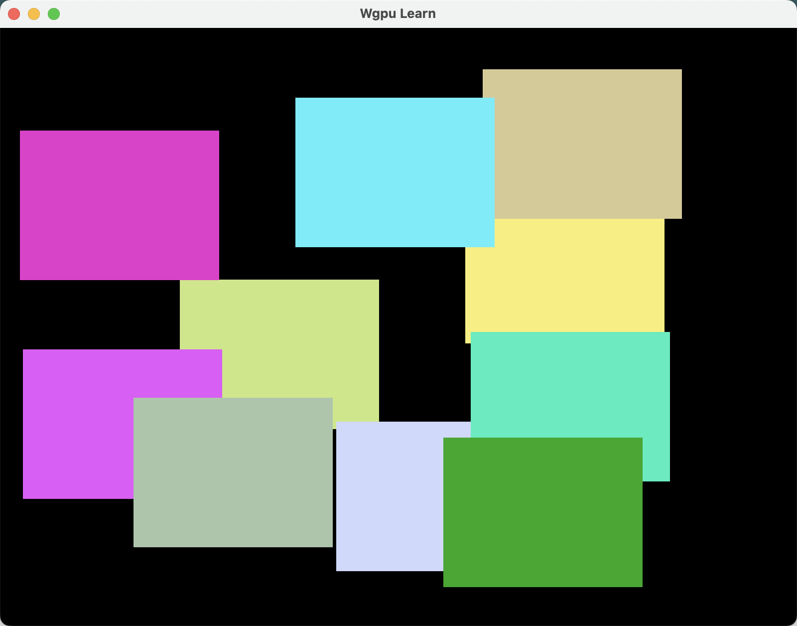

## 六、WebGPU 基础入门——Vertex 缓冲区和 Index 缓冲区

WebGPU中的顶点缓冲区是存储顶点数据（如位置、颜色、纹理坐标等）的GPU显存区域，用于向顶点着色器提供几何图形渲染所需的数据。
本节将介绍如何创建和使用顶点缓冲区。

在前面的章节中，我们的三角形顶点数据是硬编码在着色器中的，这种方式不够灵活和高效。我们将创建一个顶点缓冲区，将顶点数据传递给GPU。

首先，我们需要修改`wgsl`文件

```wgsl
struct Params {
    color: vec4f,
    offset: vec2f,
    scale: f32,
}

@group(0) @binding(0) var<storage> params_list: array<Params>;

struct VertexOutput {
    @builtin(position) position: vec4f,
    @location(0) color: vec4f,
}

// 顶点输入结构体
// 这里我们只需要位置数据
struct VertexInput {
    @location(0) position: vec2f,
}

@vertex
fn vs(
    // @builtin(vertex_index) vertex_index: u32 // 这里我们不需要使用内置的顶点索引
    vertex_input: VertexInput, 
    @builtin(instance_index) instance_index: u32
) -> VertexOutput {

    // 使用instance_index来选择params_list中的参数
    let params = params_list[instance_index];

    
    // var pos = array(
    //     vec2f(0.0, 0.5),
    //     vec2f(-0.5, -0.5),
    //     vec2f(0.5, -0.5),
    // );

    // 使用vertex_input.position来获取顶点位置
    var output = VertexOutput(
        vec4f(vertex_input.position * params.scale + params.offset, 0.0, 1.0),
        params.color,
    );

    return output;
}


@fragment
fn fs(vsOutput: VertexOutput) -> @location(0) vec4f {
    return vsOutput.color;
}

```

然后在`lib.rs`中，新建一个`Vertex`结构体来存储顶点数据。

```rust
#[repr(C)]
#[derive(Debug, Clone, Copy, bytemuck::Pod, bytemuck::Zeroable)]
struct Vertex {
    position: [f32; 2],
}
```

在WGSL代码中，`VertexInput`结构体的`position`字段通过`@location(0)`进行了标注。因此在构建渲染管线时，必须通过顶点缓冲区布局明确指定该属性在顶点数据中的内存布局，以建立着色器属性与缓冲区数据之间的映射关系。

```rust
impl Vertex {
    pub fn desc<'a>() -> wgpu::VertexBufferLayout<'a> {
        wgpu::VertexBufferLayout {
            // 顶点数据步长（每个顶点占字节数）
            // 计算Vertex结构体的大小（2x4字节 = 8字节）
            // 告诉GPU每个顶点数据在缓冲区中占据的字节数，用于逐顶点读取
            array_stride: core::mem::size_of::<Vertex>() as wgpu::BufferAddress,

            // 步进模式：每个顶点使用新的数据
            // VertexStepMode::Vertex表示每个顶点都会获取新的属性值
            step_mode: wgpu::VertexStepMode::Vertex,

            // 顶点属性数组：定义顶点数据如何映射到着色器
            // 此处配置了一个属性：
            // - offset: 0（从缓冲区起始位置开始）
            // - shader_location: 0（对应着色器中location=0的属性）
            // - format: Float32x2（2个32位浮点数，对应position字段）
            attributes: &[wgpu::VertexAttribute {
                offset: 0,
                shader_location: 0,
                format: wgpu::VertexFormat::Float32x2,
            }],
        }
    }

    // 可以通过`wgpu::vertex_attr_array!`宏来简化描述
    pub const LAYOUT: wgpu::VertexBufferLayout<'static> = wgpu::VertexBufferLayout {
        array_stride: core::mem::size_of::<Vertex>() as wgpu::BufferAddress,
        step_mode: wgpu::VertexStepMode::Vertex,
        attributes: &wgpu::vertex_attr_array![
            0 => Float32x2
        ],
    };

    // 三角形的顶点数据
    pub const TRIANGLE: [Vertex; 3] = [
        Vertex {
            position: [0.0, 0.5],
        },
        Vertex {
            position: [-0.5, -0.5],
        },
        Vertex {
            position: [0.5, -0.5],
        },
    ];
}
```

然后，创建顶点缓冲区

```rust
pub struct WgpuApp {
    // ...
    pub vertex_buffer: wgpu::Buffer, // 顶点缓冲区
}

impl WgpuApp {
    pub async fn new(window: Arc<Window>) -> Result<Self> {
        // ...

        // 6. 创建着色器模块（加载WGSL着色器）
        let shader = device.create_shader_module(include_wgsl!("../../source/vertex.wgsl"));

        // 7. 创建渲染管线

        let pipeline = device.create_render_pipeline(&wgpu::RenderPipelineDescriptor {
            label: Some("Render Pipeline"),
            layout: None, // 使用默认管线布局
            vertex: wgpu::VertexState {
                module: &shader,
                entry_point: Some("vs"),
                buffers: &[Vertex::Layout], // 顶点缓冲区布局
                compilation_options: Default::default(),
            },
            // ...
        });

        // ...

        let vertex_buffer = device.create_buffer_init(&wgpu::util::BufferInitDescriptor {
            label: Some("Vertex Buffer"),
            contents: bytemuck::cast_slice(&Vertex::TRIANGLE), // 使用三角形顶点数据
            usage: wgpu::BufferUsages::VERTEX | wgpu::BufferUsages::COPY_DST,
        });

        Ok(Self {
            // ...
            vertex_buffer,
        })
    }
}

```

在`render`函数中，绑定顶点缓冲区

```rust
pub fn render(&mut self) -> Result<()> {
    // ...
    {
        // ...
        pass.set_pipeline(&self.pipeline);
        pass.set_bind_group(0, &self.bind_group, &[]);

        // 设置顶点缓冲区
        pass.set_vertex_buffer(0, self.vertex_buffer.slice(..));

        // vertices参数要与TRIANGLE的长度一致
        pass.draw(0..Vertex::TRIANGLE.len() as u32, 0..self.instance_length);
    }

    // ...
}
```

然后运行

```bash
cargo run
```

你会看到10三角形在窗口中渲染出来。

### 使用顶点缓冲区进行多实例绘制

在上面的代码中，我们使用了顶点缓冲区来存储三角形的顶点数据，节省了`@builtin(vertex_index)`的使用。是否也可以使用顶点缓冲区来节省`@builtin(instance_index)`的使用呢？答案是肯定的。

首先，修改`wgsl`文件

```wgsl
// 为每个字段添加@location属性
struct Params {
    @location(1) color: vec4f,
    @location(2) offset: vec2f,
    @location(3) scale: f32,
}

@group(0) @binding(0) var<storage> params_list: array<Params>;

struct VertexOutput {
    @builtin(position) position: vec4f,
    @location(0) color: vec4f,
}

// 顶点输入结构体
// 这里我们只需要位置数据
struct VertexInput {
    @location(0) position: vec2f,
}

@vertex
fn vs(
    // @builtin(vertex_index) vertex_index: u32 // 这里我们不需要使用内置的顶点索引
    vertex_input: VertexInput, 
    // @builtin(instance_index) instance_index: u32
    params: Params
) -> VertexOutput {

    // 使用instance_index来选择params_list中的参数
    // let params = params_list[instance_index];

    // var pos = array(
    //     vec2f(0.0, 0.5),
    //     vec2f(-0.5, -0.5),
    //     vec2f(0.5, -0.5),
    // );

    // 使用vertex_input.position来获取顶点位置
    var output = VertexOutput(
        vec4f(vertex_input.position * params.scale + params.offset, 0.0, 1.0),
        params.color,
    );

    return output;
}


@fragment
fn fs(vsOutput: VertexOutput) -> @location(0) vec4f {
    return vsOutput.color;
}

```

然后在`lib.rs`中，修改`Params`结构体

```rust
#[repr(C)]
#[derive(Debug, PartialEq, Clone, Copy, bytemuck::Pod, bytemuck::Zeroable)]
pub struct Params {
    /// size: 16, offset: 0, type: `vec4<f32>`
    pub color: [f32; 4],
    /// size: 8, offset: 16 (2*8), type: `vec2<f32>`
    pub offset: [f32; 2],
    /// size: 4, offset: 24 (4*6), type: `f32`
    pub scale: f32,
    // pub _pad_scale: [u8; 0x8 - core::mem::size_of::<f32>()],
}
```

由于通过顶点缓冲区布局显式定义了内存布局，因此无需手动添加`_pad_scale`字段进行对齐填充。

然后为`Params`结构体定义`wgpu::VertexBufferLayout`，并在创建渲染管线时使用它。

```rust
impl Params {
    // ...

    /// 定义Params结构体的顶点缓冲区布局，用于多实例渲染参数传递
    ///
    /// # 配置说明：
    /// - `array_stride`：结构体总字节大小（16字节）
    /// - `step_mode`：每个实例使用新数据（Instance模式）
    /// - `attributes`：与WGSL中@location标记的字段一一对应
    pub const LAYOUT: wgpu::VertexBufferLayout<'static> = wgpu::VertexBufferLayout {
        // 结构体总字节长度（4*4 + 2*4 + 1*4 = 16字节）
        array_stride: std::mem::size_of::<Params>() as wgpu::BufferAddress,

        // 实例步进模式：每个实例获取新数据
        step_mode: wgpu::VertexStepMode::Instance,

        // 属性映射配置：
        // 使用vertex_attr_array宏简化定义
        // 格式与WGSL中@location标记的字段对应：
        //   1 → color（vec4f）
        //   2 → offset（vec2f）
        //   3 → scale（f32）
        attributes: &wgpu::vertex_attr_array![
            1 => Float32x4,  // 对应@location(1) color
            2 => Float32x2,  // 对应@location(2) offset
            3 => Float32     // 对应@location(3) scale
        ],
    };
}
```

然后在`WgpuApp`中创建实例缓冲区

```rust
pub struct WgpuApp {
    pub window: Arc<Window>,                // 窗口对象
    pub surface: wgpu::Surface<'static>,    // GPU表面（用于绘制到窗口）
    pub device: wgpu::Device,               // GPU设备抽象
    pub queue: wgpu::Queue,                 // 命令队列（用于提交GPU命令）
    pub config: wgpu::SurfaceConfiguration, // 表面配置（格式、尺寸等）
    pub pipeline: wgpu::RenderPipeline,     // 渲染管线（包含着色器、状态配置等）
    pub instance_length: u32,
    pub vertex_buffer: wgpu::Buffer,
    pub instance_buffer: wgpu::Buffer,
}

impl WgpuApp {
    /// 异步构造函数：初始化WebGPU环境
    pub async fn new(window: Arc<Window>) -> Result<Self> {
        // 1. 创建WebGPU实例
        let instance = wgpu::Instance::new(&wgpu::InstanceDescriptor::default());

        // 2. 创建窗口表面
        let surface = instance.create_surface(window.clone())?;

        // 3. 请求图形适配器（选择GPU）
        let adapter = instance
            .request_adapter(&wgpu::RequestAdapterOptions {
                power_preference: wgpu::PowerPreference::default(), // 默认选择高性能GPU
                compatible_surface: Some(&surface),                 // 需要与表面兼容
                force_fallback_adapter: false,
            })
            .await?;

        // 4. 创建设备和命令队列
        let (device, queue) = adapter
            .request_device(&wgpu::DeviceDescriptor {
                label: Some("Device"),
                required_features: wgpu::Features::empty(),
                required_limits: wgpu::Limits::default(),
                memory_hints: wgpu::MemoryHints::Performance,
                trace: wgpu::Trace::Off,
            })
            .await?;

        // 5. 配置表面（设置像素格式、尺寸等）
        let config = surface
            .get_default_config(
                &adapter,
                window.inner_size().width.max(1),  // 确保最小宽度为1
                window.inner_size().height.max(1), // 确保最小高度为1
            )
            .unwrap();
        surface.configure(&device, &config);

        // 6. 创建着色器模块（加载WGSL着色器）
        let shader = device.create_shader_module(include_wgsl!("../../source/vertex.wgsl"));

        // 7. 创建渲染管线

        let pipeline = device.create_render_pipeline(&wgpu::RenderPipelineDescriptor {
            label: Some("Render Pipeline"),
            layout: None, // 使用默认管线布局
            vertex: wgpu::VertexState {
                module: &shader,                            // 顶点着色器模块
                entry_point: Some("vs"),                    // 入口函数
                buffers: &[Vertex::LAYOUT, Params::LAYOUT], // 顶点缓冲区布局
                compilation_options: Default::default(),
            },
            fragment: Some(wgpu::FragmentState {
                module: &shader,         // 片元着色器模块
                entry_point: Some("fs"), // 入口函数
                targets: &[Some(wgpu::ColorTargetState {
                    format: config.format,                  // 使用表面配置的格式
                    blend: Some(wgpu::BlendState::REPLACE), // 混合模式：直接替换
                    write_mask: wgpu::ColorWrites::ALL,     // 允许写入所有颜色通道
                })],
                compilation_options: Default::default(),
            }),
            primitive: Default::default(), // 使用默认图元配置（三角形列表）
            depth_stencil: None,           // 禁用深度/模板测试
            multisample: Default::default(), // 多重采样配置
            multiview: None,
            cache: None,
        });

        let instance_length = 10;
        let params_list = (0..instance_length)
            .map(|_| Params::random())
            .collect::<Vec<_>>();

        // 创建实例缓冲区
        let instance_buffer = device.create_buffer_init(&wgpu::util::BufferInitDescriptor {
            label: Some("Uniform Buffer"),
            contents: bytemuck::cast_slice(&params_list),
            usage: wgpu::BufferUsages::VERTEX | wgpu::BufferUsages::COPY_DST,
        });

        // 创建顶点缓冲区
        let vertex_buffer = device.create_buffer_init(&wgpu::util::BufferInitDescriptor {
            label: Some("Vertex Buffer"),
            contents: bytemuck::cast_slice(&Vertex::TRIANGLE),
            usage: wgpu::BufferUsages::VERTEX | wgpu::BufferUsages::COPY_DST,
        });

        Ok(Self {
            window,
            surface,
            device,
            queue,
            config,
            pipeline,
            instance_length,
            vertex_buffer,
            instance_buffer,
        })
    }
}
```

然后在`render`函数中，绑定实例缓冲区

```rust
/// 执行渲染操作
pub fn render(&mut self) -> Result<()> {
    // ...
    {
        let mut pass = encoder.begin_render_pass(&wgpu::RenderPassDescriptor {
            label: Some("Render Pass"),
            color_attachments: &[Some(wgpu::RenderPassColorAttachment {
                view: &view,
                ops: wgpu::Operations {
                    load: wgpu::LoadOp::Clear(Color::BLACK), // 用黑色清除背景
                    store: wgpu::StoreOp::Store,             // 存储渲染结果
                },
                resolve_target: None,
            })],
            depth_stencil_attachment: None,
            timestamp_writes: None,
            occlusion_query_set: None,
        });

        pass.set_pipeline(&self.pipeline);
        // pass.set_bind_group(0, &self.bind_group, &[]);

        // 设置顶点缓冲区
        pass.set_vertex_buffer(0, self.vertex_buffer.slice(..));
        // 设置实例缓冲区
        pass.set_vertex_buffer(1, self.instance_buffer.slice(..));

        // vertices参数要与TRIANGLE的长度一致
        pass.draw(0..Vertex::TRIANGLE.len() as u32, 0..self.instance_length);
    }

    // ...
}
```

然后运行

```bash
cargo run
```

你会看到10三角形在窗口中渲染出来。跟之前的效果一样。

### 索引缓冲区(Index Buffers)

接下来我们稍微加点难度，绘制正方形。

我们通过两个三角形拼起来组成正方形。

```rust
// 0--1 4
// | / /|
// |/ / |
// 2 3--5
pub const SQUARE: [Vertex; 6] = [
    
    // 第一个三角形
    Vertex {
        position: [-0.5, -0.5],
    },
    Vertex {
        position: [0.5, -0.5],
    },
    Vertex {
        position: [-0.5, 0.5],
    },
    // 第二个三角形
    Vertex {
        position: [-0.5, 0.5],
    },
    Vertex {
        position: [0.5, -0.5],
    },
    Vertex {
        position: [0.5, 0.5],
    },
];
```

然后将之前使用的`TRIANGLE`替换为`SQUARE`。



但是我们观察数据，发现有两个顶点是重复的。绘制矩形尚且如此，如果绘制一个复杂的模型，顶点数据就会非常庞大。
为了避免这种情况，我们可以使用索引缓冲区来复用顶点数据。
索引缓冲区是一个存储整数索引的缓冲区，用于指定顶点缓冲区中顶点的顺序。通过索引缓冲区，我们可以在绘制时引用顶点缓冲区中的顶点，而不是重复存储它们。

下面我们来看看如何使用索引缓冲区。

首先修改`SQUARE`,然后添加索引数据

```rust
// 0--1
// | /|
// |/ |
// 2--3
pub const SQUARE: [Vertex; 4] = [
    // 第一个三角形
    Vertex {
        position: [-0.5, -0.5],
    },
    Vertex {
        position: [0.5, -0.5],
    },
    Vertex {
        position: [-0.5, 0.5],
    },
    Vertex {
        position: [0.5, 0.5],
    },
];

pub const SQUARE_INDEXED: [u16; 6] = [0, 1, 2, 2, 1, 3];
```

然后在`WgpuApp`中创建索引缓冲区

```rust
pub struct WgpuApp {
    // ...
    pub index_buffer: wgpu::Buffer,
}

impl WgpuApp {
    pub async fn new(window: Arc<Window>) -> Result<Self> {
        // ...

        let index_buffer = device.create_buffer_init(&wgpu::util::BufferInitDescriptor {
            label: Some("Index Buffer"),
            contents: bytemuck::cast_slice(&Vertex::SQUARE_INDEXED),
            usage: wgpu::BufferUsages::INDEX | wgpu::BufferUsages::COPY_DST,
        });

        Ok(Self {
            // ...
            index_buffer,
        })
    }
}

```

然后在`render`函数中，绑定索引缓冲区

```rust
/// 执行渲染操作
pub fn render(&mut self) -> Result<()> {
    // ...
    {
        // ...
        // 设置顶点缓冲区
        pass.set_vertex_buffer(0, self.vertex_buffer.slice(..));
        pass.set_vertex_buffer(1, self.instance_buffer.slice(..));

        // 设置索引缓冲区
        pass.set_index_buffer(self.index_buffer.slice(..), wgpu::IndexFormat::Uint16);

        // vertices参数要与TRIANGLE的长度一致
        // pass.draw(0..Vertex::SQUARE.len() as u32, 0..self.instance_length);
        // 使用索引绘制
        pass.draw_indexed(
            0..Vertex::SQUARE_INDEXED.len() as u32,
            0,
            0..self.instance_length,
        );
    }

    // ...
}
```

注意：需要将`draw`函数替换为`draw_indexed`函数，并传入索引缓冲区的长度。
`draw_indexed`函数的第一个参数是索引缓冲区的长度，第二个参数是索引偏移量，第三个参数是实例数量。

然后运行

```bash
cargo run
```

得到的结果应该和之前一样。

typescript中使用方式与rust类似，就不在这里赘述了。
下面直接贴出代码：

```typescript
import "./style.css";
import storageWgsl from "../../source/vertex.wgsl?raw";

class WebGPUApp {
  constructor(
    public device: GPUDevice,
    public queue: GPUQueue,
    public canvas: HTMLCanvasElement,
    public ctx: GPUCanvasContext,
    public pipeline: GPURenderPipeline,
    public vertex_buffer: GPUBuffer,
    public instance_buffer: GPUBuffer,
    public index_buffer: GPUBuffer
  ) {
    const observer = new ResizeObserver((entries) => {
      for (const entry of entries) {
        const canvas = entry.target as HTMLCanvasElement;
        const width = entry.contentBoxSize[0].inlineSize;
        const height = entry.contentBoxSize[0].blockSize;
        canvas.width = Math.min(width, device.limits.maxTextureDimension2D);
        canvas.height = Math.min(height, device.limits.maxTextureDimension2D);
      }
    });
    observer.observe(canvas);
  }

  public static async create() {
    const adapter = await navigator.gpu.requestAdapter();
    // 请求GPU设备
    const device = await adapter?.requestDevice();
    if (!device) {
      throw new Error("Couldn't request WebGPU device");
    }

    // 创建画布元素
    const canvas = document.createElement("canvas");
    document.querySelector("#app")?.appendChild(canvas);

    // 获取WebGPU上下文
    const ctx = canvas.getContext("webgpu");
    if (!ctx) {
      throw new Error("Couldn't get WebGPU context");
    }

    // 获取首选画布格式
    const preferredFormat = navigator.gpu.getPreferredCanvasFormat();

    // 配置画布上下文
    ctx.configure({
      device,
      format: preferredFormat,
    });

    // 创建着色器模块
    const shader = device.createShaderModule({
      code: storageWgsl, // 加载 WGSL 着色器代码
    });

    // 创建渲染管线
    const pipeline = device.createRenderPipeline({
      layout: "auto",
      vertex: {
        module: shader,
        entryPoint: "vs", // 顶点着色器入口
        buffers: [Vertex.LAYOUT, Params.LAYOUT],
      },
      fragment: {
        module: shader,
        entryPoint: "fs", // 片元着色器入口
        targets: [
          {
            format: preferredFormat, // 渲染目标格式
          },
        ],
      },
    });
    const vertexData = new Float32Array(
      Vertex.SQUARE.flatMap((v) => v.position)
    );

    // 创建 GPU 缓冲区以存储 uniform 数据
    const vertexBuffer = device.createBuffer({
      size: vertexData.byteLength, // 缓冲区大小与 uniform 数据大小一致
      usage: GPUBufferUsage.VERTEX | GPUBufferUsage.COPY_DST, // 用作 uniform 缓冲区并支持写入
    });

    // 将 uniform 数据写入缓冲区
    device.queue.writeBuffer(vertexBuffer, 0, vertexData);

    const indexBuffer = device.createBuffer({
      size: Vertex.SQUARE_INDICES.byteLength,
      usage: GPUBufferUsage.INDEX | GPUBufferUsage.COPY_DST,
    });

    device.queue.writeBuffer(indexBuffer, 0, Vertex.SQUARE_INDICES);

    const instanceData = new Float32Array(
      Array.from({ length: 10 })
        .map(() => Params.random())
        .flatMap((p) => [...p.color, ...p.offset, p.scale])
    );

    const instanceBuffer = device.createBuffer({
      size: instanceData.byteLength,
      usage: GPUBufferUsage.VERTEX | GPUBufferUsage.COPY_DST,
    });
    device.queue.writeBuffer(instanceBuffer, 0, instanceData);

    return new WebGPUApp(
      device,
      device.queue,
      canvas,
      ctx,
      pipeline,
      vertexBuffer,
      instanceBuffer,
      indexBuffer
    );
  }

  public render() {
    const { device, ctx, pipeline } = this;
    // 创建命令编码器（用于记录一系列GPU执行命令）
    const encoder = device.createCommandEncoder();

    // 获取当前Canvas的输出纹理（WebGPU渲染目标）
    const output = ctx.getCurrentTexture();
    const view = output.createView(); // 创建纹理视图用于渲染目标绑定

    // 开始渲染通道配置
    const pass = encoder.beginRenderPass({
      colorAttachments: [
        // 配置颜色附件数组（此处仅使用一个主颜色目标）
        {
          view, // 绑定之前创建的纹理视图作为渲染目标
          clearValue: { r: 0, g: 0, b: 0, a: 1 }, // 设置清除颜色为黑色（RGB 0,0,0）
          loadOp: "clear", // 渲染前清除颜色缓冲区
          storeOp: "store", // 渲染完成后将结果存储到颜色缓冲区
        },
      ],
    });

    // 绑定当前渲染管线配置（顶点/片元着色器等）
    pass.setPipeline(pipeline);

    pass.setVertexBuffer(0, this.vertex_buffer); // 绑定顶点缓冲区
    pass.setVertexBuffer(1, this.instance_buffer); // 绑定实例缓冲区
    pass.setIndexBuffer(this.index_buffer, "uint16"); // 绑定索引缓冲区
    pass.drawIndexed(Vertex.SQUARE_INDICES.length, 10); // 绘制索引缓冲区中的图形

    // 结束当前渲染通道的配置
    pass.end();

    // 生成最终的命令缓冲区（包含所有已记录的渲染指令）
    const commandBuffer = encoder.finish(); // 修正拼写错误：commanderBuffer → commandBuffer
    device.queue.submit([commandBuffer]); // 将命令提交到GPU队列执行
  }
}

async function main() {
  const app = await WebGPUApp.create();

  // 使用 requestAnimationFrame 实现持续渲染
  const renderLoop = () => {
    app.render();
    requestAnimationFrame(renderLoop);
  };

  requestAnimationFrame(renderLoop);
}

// 调用主函数
main();

class Vertex {
  constructor(public position: [number, number]) {}

  static LAYOUT: GPUVertexBufferLayout = {
    arrayStride: 2 * 4,
    stepMode: "vertex",
    attributes: [
      {
        shaderLocation: 0,
        offset: 0,
        format: "float32x2",
      },
    ],
  };

  static SQUARE: Vertex[] = [
    new Vertex([-0.5, -0.5]),
    new Vertex([0.5, -0.5]),
    new Vertex([-0.5, 0.5]),
    new Vertex([0.5, 0.5]),
  ];

  static SQUARE_INDICES: Uint16Array = new Uint16Array([
    0,
    1,
    2, // Triangle 1
    2,
    1,
    3, // Triangle 2
  ]);
}

class Params {
  constructor(
    public color: [number, number, number, number],
    public offset: [number, number],
    public scale: number
  ) {}

  static LAYOUT: GPUVertexBufferLayout = {
    arrayStride: 4 * 7,
    stepMode: "instance",
    attributes: [
      {
        shaderLocation: 1,
        offset: 0,
        format: "float32x4",
      },
      {
        shaderLocation: 2,
        offset: 4 * 4,
        format: "float32x2",
      },
      {
        shaderLocation: 3,
        offset: 6 * 4,
        format: "float32",
      },
    ],
  };

  static random() {
    return new Params(
      [random(0, 1), random(0, 1), random(0, 1), 1],
      [random(-1, 1), random(-1, 1)],
      0.5
    );
  }
}

function random(start: number, end: number) {
  return Math.random() * (end - start) + start;
}
```
