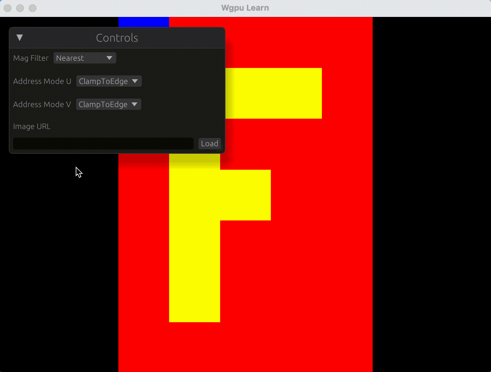

## 八、WebGPU 基础入门——加载图像纹理

本节将介绍如何加载图像纹理到 WebGPU 中，并在屏幕上绘制出来。我们将使用 `image` crate 来加载图像文件，并将其转换为 WebGPU 可用的纹理格式。本节会使用`egui` 来实现一个简单的 UI 界面。如何集成`egui`，请参考[kaphula/winit-egui-wgpu-template](https://github.com/kaphula/winit-egui-wgpu-template)。

### 1.安装依赖

```bash
cargo add image reqwest
```

### 2.编写shader

在`source/texture.wgsl`中添加以下代码：

```wgsl
// 定义顶点输出结构体，包含位置和纹理坐标
struct VertexOutput {
    @builtin(position) position: vec4f,
    @location(0) texcoord: vec2f,
}

// 定义绑定组和绑定点的变量，用于采样器和纹理
@group(0) @binding(0) var ourSampler: sampler;
@group(0) @binding(1) var ourTexture: texture_2d<f32>;

// 定义uniform变量，用于传递缩放参数
// 这里的缩放参数是一个二维向量，表示在x和y方向上的缩放比例
@group(1) @binding(0) var<uniform> scale: vec2f;

// 顶点着色器函数，计算顶点位置和纹理坐标
@vertex
fn vs(@builtin(vertex_index) vertex_index: u32) -> VertexOutput {
    // 定义顶点位置数组
    let pos = array(vec2(-1.0, -1.0), vec2(1.0, -1.0), vec2(-1.0, 1.0), vec2(1.0, -1.0), vec2(1.0, 1.0), vec2(-1.0, 1.0));

    // 返回顶点输出，位置经过缩放，纹理坐标归一化到[0, 1]
    return VertexOutput(vec4f(pos[vertex_index] * scale, 0.0, 1.0),(pos[vertex_index] + vec2(1.0, 1.0)) * 0.5);
}

// 片段着色器函数，采样纹理并返回颜色
@fragment
fn fs(in: VertexOutput) -> @location(0) vec4f {
    return textureSample(ourTexture, ourSampler, in.texcoord);
}

```

### 3.添加UI

在`src/controls.rs`中添加以下代码：

```rust
// 定义一个结构体 Controls，用于存储控件的状态
#[derive(Debug, Clone)]
pub struct Controls {
    pub mag_filter: wgpu::FilterMode,      // 纹理放大过滤模式
    pub address_mode_u: wgpu::AddressMode, // 纹理 U 轴寻址模式
    pub address_mode_v: wgpu::AddressMode, // 纹理 V 轴寻址模式
    pub image_url: String,                 // 图像 URL
}

impl Controls {
    // 创建一个新的 Controls 实例，初始化默认值
    pub fn new() -> Self {
        Self {
            mag_filter: wgpu::FilterMode::Nearest, // 默认使用最近点采样
            address_mode_u: wgpu::AddressMode::ClampToEdge, // 默认 U 轴边缘拉伸
            address_mode_v: wgpu::AddressMode::ClampToEdge, // 默认 V 轴边缘拉伸
            image_url: String::new(),              // 默认空字符串
        }
    }

    // 渲染控件的 UI
    pub fn render(
        &mut self,
        ctx: &egui::Context,             // egui 上下文
        mut on_change: impl FnMut(Self), // 当控件值改变时的回调函数
    ) {
        egui::Window::new("Controls").show(ctx, |ui| {
            // 渲染 Mag Filter 下拉框
            ui.horizontal(|ui| {
                ui.label("Mag Filter");
                egui::ComboBox::from_id_salt("mag_filter")
                    .selected_text(format!("{:?}", self.mag_filter))
                    .show_ui(ui, |ui| {
                        let a = ui
                            .selectable_value(
                                &mut self.mag_filter,
                                wgpu::FilterMode::Nearest,
                                "Nearest",
                            )
                            .changed();
                        let b = ui
                            .selectable_value(
                                &mut self.mag_filter,
                                wgpu::FilterMode::Linear,
                                "Linear",
                            )
                            .changed();
                        a || b
                    })
                    .inner
                    .map(|changed| {
                        if changed {
                            on_change(self.clone()); // 如果值改变，调用回调函数
                        }
                    })
            });
            ui.add_space(16.0); // 添加间距

            // 渲染 Address Mode U 下拉框
            ui.horizontal(|ui| {
                ui.label("Address Mode U");
                egui::ComboBox::from_id_salt("address_mode_u")
                    .selected_text(format!("{:?}", self.address_mode_u))
                    .show_ui(ui, |ui| {
                        let a = ui
                            .selectable_value(
                                &mut self.address_mode_u,
                                wgpu::AddressMode::ClampToEdge,
                                "ClampToEdge",
                            )
                            .changed();
                        let b = ui
                            .selectable_value(
                                &mut self.address_mode_u,
                                wgpu::AddressMode::Repeat,
                                "Repeat",
                            )
                            .changed();
                        a || b
                    })
                    .inner
                    .map(|changed| {
                        if changed {
                            on_change(self.clone()); // 如果值改变，调用回调函数
                        }
                    })
            });
            ui.add_space(16.0); // 添加间距

            // 渲染 Address Mode V 下拉框
            ui.horizontal(|ui| {
                ui.label("Address Mode V");

                egui::ComboBox::from_id_salt("address_mode_v")
                    .selected_text(format!("{:?}", self.address_mode_v))
                    .show_ui(ui, |ui| {
                        let a = ui
                            .selectable_value(
                                &mut self.address_mode_v,
                                wgpu::AddressMode::ClampToEdge,
                                "ClampToEdge",
                            )
                            .changed();
                        let b = ui
                            .selectable_value(
                                &mut self.address_mode_v,
                                wgpu::AddressMode::Repeat,
                                "Repeat",
                            )
                            .changed();
                        a || b
                    })
                    .inner
                    .map(|changed| {
                        if changed {
                            on_change(self.clone()); // 如果值改变，调用回调函数
                        }
                    })
            });
            ui.add_space(16.0); // 添加间距

            // 渲染 Image URL 文本框和加载按钮
            ui.vertical(|ui| {
                ui.label("Image URL");
                ui.add_space(8.0); // 添加间距
                ui.horizontal(|ui| {
                    ui.text_edit_singleline(&mut self.image_url); // 文本框输入 URL
                    if ui.button("Load").clicked() {
                        on_change(self.clone()); // 点击加载按钮时调用回调函数
                    }
                });
            })
        });
    }
}

```

### 4.添加utils模块

在`src/utils.rs`中添加以下代码：

```rust

use image::DynamicImage;
// 使用 `reqwest` 和 `image` 库从给定的 URL 加载图像数据，并返回 `DynamicImage` 类型的结果
pub fn load_image_data(url: &str) -> anyhow::Result<DynamicImage> {
    // 通过 `reqwest::blocking::get` 获取 URL 的数据并转换为字节
    let data = reqwest::blocking::get(url)?.bytes()?;
    // 使用 `image::load_from_memory` 从字节数据加载图像
    Ok(image::load_from_memory(&data)?)
}

// 计算图像在屏幕上的缩放比例，返回一个包含宽度和高度缩放比例的数组
pub fn calc_scale(image: [f32; 2], screen: [f32; 2]) -> [f32; 2] {
    // 解构图像和屏幕的宽度和高度
    let [width, height] = image;
    let [screen_width, screen_height] = screen;

    // 计算图像和屏幕的宽高比
    let image_ratio = width / height;
    let screen_ratio = screen_width / screen_height;

    // 根据宽高比调整缩放比例
    if image_ratio > screen_ratio {
        [1.0, screen_ratio / image_ratio] // 图像宽度占满屏幕，高度按比例缩放
    } else {
        [image_ratio / screen_ratio, 1.0] // 图像高度占满屏幕，宽度按比例缩放
    }
}
```

### 5.修改`WgpuApp`模块

```rust

use anyhow::Result;
use egui_wgpu::ScreenDescriptor;
use image::GenericImageView;
use std::sync::Arc;
use utils::calc_scale;
use wgpu::{Color, include_wgsl, util::DeviceExt};
use winit::window::Window;
pub mod controls;
pub mod egui_render;
pub mod utils;


// Wgpu应用核心结构体
pub struct WgpuApp {
    // ...
    pub egui_renderer: egui_render::EguiRenderer, // Egui渲染器
    pub controls: controls::Controls,
    pub scale_bind_group: wgpu::BindGroup,
    pub scale_buffer: wgpu::Buffer,
    pub image_dimensions: [f32; 2],
}

impl WgpuApp {
    /// 异步构造函数：初始化WebGPU环境
    pub async fn new(window: Arc<Window>) -> Result<Self> {
        // ...
        
        // 5. 配置表面（设置像素格式、尺寸等）
        let config = surface
            .get_default_config(
                &adapter,
                window.inner_size().width.max(1),  // 确保最小宽度为1
                window.inner_size().height.max(1), // 确保最小高度为1
            )
            .unwrap();
        surface.configure(&device, &config);
    
        let egui_render = egui_render::EguiRenderer::new(&device, config.format, None, 1, &window);

        // 6. 创建着色器模块（加载WGSL着色器）
        let shader = device.create_shader_module(include_wgsl!("../../source/texture.wgsl"));

        // 7. 创建渲染管线

        let pipeline = device.create_render_pipeline(&wgpu::RenderPipelineDescriptor {
            label: Some("Render Pipeline"),
            layout: None, // 使用默认管线布局
            vertex: wgpu::VertexState {
                module: &shader,         // 顶点着色器模块
                entry_point: Some("vs"), // 入口函数
                buffers: &[],            // 顶点缓冲区布局（本示例为空）
                compilation_options: Default::default(),
            },
            fragment: Some(wgpu::FragmentState {
                module: &shader,         // 片元着色器模块
                entry_point: Some("fs"), // 入口函数
                targets: &[Some(wgpu::ColorTargetState {
                    format: config.format,                  // 使用表面配置的格式
                    blend: Some(wgpu::BlendState::REPLACE), // 混合模式：直接替换
                    write_mask: wgpu::ColorWrites::ALL,     // 允许写入所有颜色通道
                })],
                compilation_options: Default::default(),
            }),
            primitive: Default::default(), // 使用默认图元配置（三角形列表）
            depth_stencil: None,           // 禁用深度/模板测试
            multisample: Default::default(), // 多重采样配置
            multiview: None,
            cache: None,
        });

        let texture_data = gen_texture_data();
        let texture_size = wgpu::Extent3d {
            width: 5,
            height: 7,
            ..Default::default()
        };
        let texture = device.create_texture(&wgpu::TextureDescriptor {
            label: Some("texture"),
            size: texture_size,
            format: wgpu::TextureFormat::Rgba8Unorm,
            usage: wgpu::TextureUsages::TEXTURE_BINDING | wgpu::TextureUsages::COPY_DST,
            mip_level_count: 1,
            sample_count: 1,
            dimension: wgpu::TextureDimension::D2,
            view_formats: &[],
        });

        queue.write_texture(
            wgpu::TexelCopyTextureInfoBase {
                texture: &texture,
                mip_level: 0,
                origin: wgpu::Origin3d::ZERO,
                aspect: wgpu::TextureAspect::All,
            },
            &texture_data,
            wgpu::TexelCopyBufferLayout {
                offset: 0,
                bytes_per_row: Some(texture_size.width * 4),
                rows_per_image: None,
            },
            texture_size,
        );
        // 创建控件
        let controls = controls::Controls::new();

        // 创建采样器
        let sampler = device.create_sampler(&wgpu::SamplerDescriptor {
            address_mode_u: controls.address_mode_u,
            address_mode_v: controls.address_mode_v,
            mag_filter: controls.mag_filter,
            ..Default::default()
        });

        let bind_group = device.create_bind_group(&wgpu::BindGroupDescriptor {
            label: None,
            layout: &pipeline.get_bind_group_layout(0),
            entries: &[
                wgpu::BindGroupEntry {
                    binding: 0,
                    resource: wgpu::BindingResource::Sampler(&sampler),
                },
                wgpu::BindGroupEntry {
                    binding: 1,
                    resource: wgpu::BindingResource::TextureView(
                        &texture.create_view(&Default::default()),
                    ),
                },
            ],
        });

        // 创建缩放缓冲区
        let scale = calc_scale([5.0, 7.0], [config.width as f32, config.height as f32]);
        let scale_buffer = device.create_buffer_init(&wgpu::util::BufferInitDescriptor {
            label: Some("Scale Buffer"),
            contents: bytemuck::cast_slice(&scale),
            usage: wgpu::BufferUsages::UNIFORM | wgpu::BufferUsages::COPY_DST,
        });
        let scale_bind_group = device.create_bind_group(&wgpu::BindGroupDescriptor {
            label: None,
            layout: &pipeline.get_bind_group_layout(1),
            entries: &[wgpu::BindGroupEntry {
                binding: 0,
                resource: scale_buffer.as_entire_binding(),
            }],
        });

        Ok(Self {
            window,
            surface,
            device,
            queue,
            config,
            pipeline,
            bind_group,
            egui_renderer: egui_render,
            texture,
            controls,
            scale_bind_group,
            scale_buffer,
            image_dimensions: [5.0, 7.0],
        })
    }

    /// 执行渲染操作
    pub fn render(&mut self) -> Result<()> {
        // 1. 获取当前帧缓冲区
        let output = self.surface.get_current_texture()?;

        // 2. 创建纹理视图
        let view = output
            .texture
            .create_view(&wgpu::TextureViewDescriptor::default());

        // 3. 创建命令编码器
        let mut encoder = self
            .device
            .create_command_encoder(&wgpu::CommandEncoderDescriptor::default());

        let screen_descriptor = ScreenDescriptor {
            size_in_pixels: [self.config.width, self.config.height],
            pixels_per_point: self.window.as_ref().scale_factor() as f32,
        };

        // 4. 开始渲染通道
        {
            let mut pass = encoder.begin_render_pass(&wgpu::RenderPassDescriptor {
                label: Some("Render Pass"),
                color_attachments: &[Some(wgpu::RenderPassColorAttachment {
                    view: &view,
                    ops: wgpu::Operations {
                        load: wgpu::LoadOp::Clear(Color::BLACK), // 用黑色清除背景
                        store: wgpu::StoreOp::Store,             // 存储渲染结果
                    },
                    resolve_target: None,
                })],
                depth_stencil_attachment: None,
                timestamp_writes: None,
                occlusion_query_set: None,
            });

            // 5. 设置渲染管线
            pass.set_pipeline(&self.pipeline);

            // 6. 设置绑定组
            pass.set_bind_group(0, &self.bind_group, &[]);
            pass.set_bind_group(1, &self.scale_bind_group, &[]);
            // 7. 使用实例化绘制
            pass.draw(0..6, 0..1);
        }

        {
            // 开始Egui帧渲染
            self.egui_renderer.begin_frame(&self.window);

            // 渲染控件并处理用户交互
            self.controls
                .render(self.egui_renderer.context(), |controls| {
                    // 检查控件中是否有新的图像URL
                    let url = controls.image_url;
                    if !url.is_empty() {
                        // 如果URL不为空，尝试加载图像数据
                        if let Ok(image) = utils::load_image_data(&url) {
                            log::info!("Loaded image from URL: {}", url);
                            let (width, height) = image.dimensions();
                            self.image_dimensions = [width as f32, height as f32];

                            // 计算缩放比例并更新缓冲区
                            let scale = calc_scale(
                                self.image_dimensions,
                                [self.config.width as f32, self.config.height as f32],
                            );
                            self.queue.write_buffer(
                                &self.scale_buffer,
                                0,
                                bytemuck::cast_slice(&scale),
                            );

                            // 创建新的纹理并加载图像数据
                            let texture_size = wgpu::Extent3d {
                                width,
                                height,
                                ..Default::default()
                            };

                            // 将图像数据转换为RGBA8格式
                            // flipv()用于翻转图像数据
                            let texture_data = image.flipv().to_rgba8().to_vec();

                            self.texture = self.device.create_texture_with_data(
                                &self.queue,
                                &wgpu::TextureDescriptor {
                                    label: Some("net_texture"),
                                    size: texture_size,
                                    format: wgpu::TextureFormat::Rgba8UnormSrgb,
                                    usage: wgpu::TextureUsages::TEXTURE_BINDING
                                        | wgpu::TextureUsages::COPY_DST
                                        | wgpu::TextureUsages::RENDER_ATTACHMENT,
                                    mip_level_count: 1,
                                    sample_count: 1,
                                    dimension: wgpu::TextureDimension::D2,
                                    view_formats: &[],
                                },
                                wgpu::util::TextureDataOrder::MipMajor,
                                &texture_data,
                            );
                        }
                    }

                    // 根据控件设置创建采样器
                    let sampler = self.device.create_sampler(&wgpu::SamplerDescriptor {
                        address_mode_u: controls.address_mode_u,
                        address_mode_v: controls.address_mode_v,
                        mag_filter: controls.mag_filter,
                        ..Default::default()
                    });

                    // 创建绑定组并更新
                    let bind_group = self.device.create_bind_group(&wgpu::BindGroupDescriptor {
                        label: None,
                        layout: &self.pipeline.get_bind_group_layout(0),
                        entries: &[
                            wgpu::BindGroupEntry {
                                binding: 0,
                                resource: wgpu::BindingResource::Sampler(&sampler),
                            },
                            wgpu::BindGroupEntry {
                                binding: 1,
                                resource: wgpu::BindingResource::TextureView(
                                    &self.texture.create_view(&Default::default()),
                                ),
                            },
                        ],
                    });
                    self.bind_group = bind_group;
                });

            // 结束Egui帧并绘制
            self.egui_renderer.end_frame_and_draw(
                &self.device,
                &self.queue,
                &mut encoder,
                &self.window,
                &view,
                screen_descriptor,
            );
        }

        // 7. 提交命令到队列
        let command_buffer = encoder.finish();
        self.queue.submit(std::iter::once(command_buffer));

        // 8. 呈现渲染结果
        output.present();

        Ok(())
    }

    /// 处理窗口大小变化
    pub fn resize(&mut self, size: winit::dpi::PhysicalSize<u32>) {
        self.config.width = size.width.max(1);
        self.config.height = size.height.max(1);
        // 重新配置表面（更新尺寸）
        self.surface.configure(&self.device, &self.config);

        // 更新缩放比例
        let scale = calc_scale(
            self.image_dimensions,
            [self.config.width as f32, self.config.height as f32],
        );
        self.queue
            .write_buffer(&self.scale_buffer, 0, bytemuck::cast_slice(&scale));
    }
}

```

然后运行

```bash
cargo run
```

在网上随便找一张图片，输入URL，点击Load按钮，就可以看到效果了。



通过上面的代码，你可以在WGPU中创建一个简单的图像渲染程序，并使用Egui来处理用户界面。可以发现，加载图片纹理的过程非常简单，只需要使用`image`库来加载图片数据，然后将其转换为WGPU可以使用的纹理格式即可。
